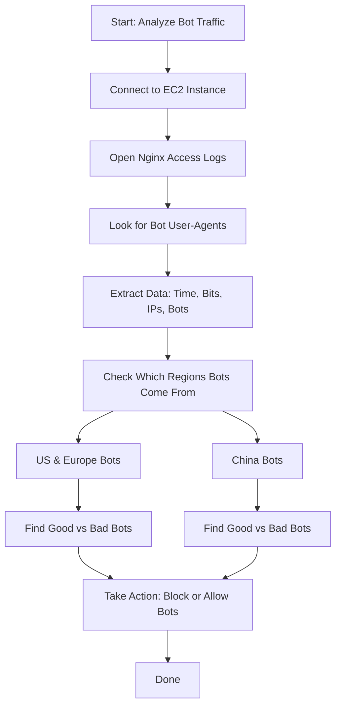

# Bot Traffic Analysis on LEMP WordPress EC2 Server

Note that I'm documenting my research while working on EC2 by AWS. You can use this documentation and perform on any server of your choice as EC2 is not the limitation.

## Introduction

This documentation explains how to check and understand bot traffic on a WordPress website running on an EC2 server with the LEMP stack (Linux, Nginx, MySQL, PHP). We'll:

1. See if bots are visiting your site.
2. Collect and format log information.
3. Find out which bots are helpful or harmful, especially for the US, Europe, and China.
4. Suggest ways to handle bad or unnecessary bots.

---

## 🗂️ Flowchart Overview



---


## 1. Connect to EC2 and Find Logs

### Connect to Your EC2 Server

```bash
ssh -i your-key.pem ubuntu@your-ec2-public-ip
```

### Find Nginx Log File

The main access log is usually at:

```bash
/var/log/nginx/access.log
```

If your Nginx site is using a custom log path, check it in your config file:

```bash
sudo nano /etc/nginx/sites-available/your-site
```

Look for a line like:

```nginx
access_log /var/log/nginx/your-site-access.log;
```

---

## 2. Check If Bots Are Visiting

### Search for Bot Requests

Use this command:

```bash
grep -i "bot\|crawl\|spider" /var/log/nginx/access.log | less
```

This looks for common words in bot user agents like "bot", "crawl", or "spider".

### Example Log Line Explained

```
66.249.66.1 - - [18/Jul/2025:10:20:50 +0000] "GET / HTTP/1.1" 200 1024 "-" "Mozilla/5.0 (compatible; Googlebot/2.1; +http://www.google.com/bot.html)"
```

- IP Address: `66.249.66.1`
- Date/Time: `18/Jul/2025:10:20:50`
- Bits Sent: `8192` (was 1024 bytes × 8)
- User Agent: `Googlebot`

---

## 3. Get Key Info From Logs

### 3.1 Time and Date

```bash
awk '{print $4}' /var/log/nginx/access.log | tr -d '[' | sort | uniq -c | head
```

This prints a summary of when requests were made.

### 3.2 Total Bits Sent

```bash
awk '{sum += $10} END {print "Total bits served:", sum * 8}' /var/log/nginx/access.log
```

> Note: `$10` contains the number of bytes, so we multiply it by 8 to convert to bits.

### 3.3 Unique IP Hits

```bash
awk '{print $1}' /var/log/nginx/access.log | sort | uniq -c | sort -nr | head
```

This shows which IPs hit the server the most.

### 3.4 List of Bots

```bash
grep -i "bot\|crawl\|spider" /var/log/nginx/access.log | awk -F\" '{print $6}' | sort | uniq -c | sort -nr | head
```

This lists and counts all bot user agents.

---

## 4. Region-Based Bot Analysis

### See Which Country Bots Are From

Install geoip tool:

```bash
sudo apt update && sudo apt install geoip-bin -y
```

Then run:

```bash
grep -i "bot" /var/log/nginx/access.log | awk '{print $1}' | sort | uniq | while read ip; do echo "$ip - $(geoiplookup $ip)"; done
```

This tells you the country of the bot's IP.

### Bots Common in Different Regions

#### ✅ US & Europe Bots

| Bot        | Is It Useful? | Is It Aggressive? | Notes                          |
|------------|---------------|-------------------|--------------------------------|
| Googlebot  | Yes           | Medium            | Important for SEO              |
| Bingbot    | Yes           | Medium            | Used by Microsoft's Bing       |
| AhrefsBot  | No            | High              | Uses lots of bandwidth (bits)  |
| SemrushBot | Maybe         | High              | Used for SEO tools             |
| YandexBot  | No            | High              | Russian; not useful for most   |

#### 🇨🇳 Chinese Bots

| Bot          | Is It Useful? | Is It Aggressive? | Notes                            |
|--------------|---------------|-------------------|----------------------------------|
| Baiduspider  | Yes           | Medium            | Used by Baidu, China's top SE   |
| Sogou Spider | Maybe         | Medium            | Used by Sogou search            |
| 360Spider    | Maybe         | High              | Often very aggressive           |

---

## 5. How to Block or Control Bots

### Use `robots.txt`

Tell bots what to access or block:

```txt
User-agent: AhrefsBot
Disallow: /

User-agent: SemrushBot
Crawl-delay: 10

User-agent: Baiduspider
Allow: /

User-agent: *
Disallow: /wp-admin/
Allow: /wp-admin/admin-ajax.php
```

### Block IPs with Firewall

```bash
sudo ufw deny from 192.168.1.100 to any
```

You can also block countries with special tools like `xtables-addons` + MaxMind DB.

### Rate Limit in Nginx

```nginx
limit_req_zone $binary_remote_addr zone=botlimit:10m rate=1r/s;

server {
  location / {
    limit_req zone=botlimit burst=5;
  }
}
```

---

##  Bot Traffic Analyzer Script (Decorated Bash)

Below is a ready-to-run Bash script for analyzing bot traffic with beautifully formatted tables and region categorization.

Save it as `bot_analysis.sh`:

````bash
#!/bin/bash

LOG_FILE="/var/log/nginx/access.log"

# Colors
GREEN='\e[32m'
RED='\e[31m'
CYAN='\e[36m'
YELLOW='\e[33m'
MAGENTA='\e[35m'
RESET='\e[0m'

print_box_top() {
  printf "┌───────────────────────────────────────────────┐\n"
  printf "│  %-43s│\n" "$1"
  printf "└───────────────────────────────────────────────┘\n"
}

# ──────────────────────────────
# SECTION 1: BOT STATUS
# ──────────────────────────────
echo -e "${CYAN}"
print_box_top "🔍 SECTION 1: BOT STATUS"
echo -e "${RESET}"

bot_count=$(grep -iE "bot|crawl|spider" "$LOG_FILE" | wc -l)

# Table header
printf "┌─────────────┬────────────────────┐\n"
printf "│ %-11s │ %-18s │\n" "BOT STATUS" "$( [ "$bot_count" -gt 0 ] && echo -e "${GREEN}DETECTED${RESET}" || echo -e "${RED}NO BOTS DETECTED${RESET}")"
printf "└─────────────┴────────────────────┘\n"

# ──────────────────────────────
# SECTION 2: ALL REQUESTS
# ──────────────────────────────
echo -e "\n${MAGENTA}"
print_box_top "📊 SECTION 2: ALL REQUESTS (including bots)"
echo -e "${RESET}"

printf "┌──────────────────────┬───────────────┬───────────────┬─────────────────────────────────────────────┐\n"
printf "│ %-20s │ %-13s │ %-13s │ %-41s │\n" "Time & Date" "Bytes" "Bits" "IP Address / Bot Name"
printf "├──────────────────────┼───────────────┼───────────────┼─────────────────────────────────────────────┤\n"

total=0
while read -r line; do
  ip=$(echo "$line" | awk '{print $1}')
  datetime=$(echo "$line" | awk '{print $4}' | tr -d '[')
  bytes=$(echo "$line" | awk '{print $10}')
  bits=$((bytes * 8))
  agent=$(echo "$line" | grep -oP '"[^"]*" "[^"]*"' | awk -F"\"" '{print $4}')
  agent=${agent:-"-"}
  printf "│ %-20s │ %-13s │ %-13s │ %-41s │\n" "$datetime" "$bytes" "$bits" "$ip / $agent"
  total=$((total + 1))
done < "$LOG_FILE"

printf "└──────────────────────┴───────────────┴───────────────┴─────────────────────────────────────────────┘\n"
printf "${YELLOW}Total Requests: $total${RESET}\n"

# ──────────────────────────────
# SECTION 3: BOT REQUESTS
# ──────────────────────────────
echo -e "\n${CYAN}"
print_box_top "🤖 SECTION 3: BOT REQUESTS ONLY (via geoiplookup)"
echo -e "${RESET}"

good_us_eu_bots=("Googlebot" "Bingbot" "DuckDuckBot")
aggressive_us_eu_bots=("AhrefsBot" "SemrushBot" "YandexBot" "DotBot" "MJ12bot" "PetalBot")
good_cn_bots=("Baiduspider" "Sogou" "Bytespider")
aggressive_cn_bots=("360Spider" "YisouSpider" "EasouSpider")

is_in_list() {
  local item=$1
  shift
  for elem in "$@"; do
    [[ "$elem" == "$item" ]] && return 0
  done
  return 1
}

analyze_bot_row() {
  ip=$1
  agent_name=$2
  datetime=$3
  bytes=$4
  bits=$5
  country_raw=$(geoiplookup "$ip" | awk -F: '{print $2}' | xargs)
  country=${country_raw:-Unknown}
  region_useu="N/A"
  region_china="N/A"

  if [[ "$country" =~ "United States" || "$country" =~ "Germany" || "$country" =~ "France" || "$country" =~ "UK" || "$country" =~ "Netherlands" ]]; then
    if is_in_list "$agent_name" "${good_us_eu_bots[@]}"; then
      region_useu="USEFUL"
    elif is_in_list "$agent_name" "${aggressive_us_eu_bots[@]}"; then
      region_useu="AGGRESSIVE"
    else
      region_useu="AGGRESSIVE"
    fi
  fi

  if [[ "$country" =~ "China" ]]; then
    if is_in_list "$agent_name" "${good_cn_bots[@]}"; then
      region_china="USEFUL"
    elif is_in_list "$agent_name" "${aggressive_cn_bots[@]}"; then
      region_china="AGGRESSIVE"
    else
      region_china="AGGRESSIVE"
    fi
  fi

  printf "│ %-15s │ %-15s │ %-13s │ %-20s │ %-18s │ %-19s │ %-17s │\n" \
    "$agent_name" "$ip" "$bytes ($bits)" "$datetime" "$country" "$region_useu" "$region_china"
}

printf "┌─────────────────┬─────────────────┬───────────────┬──────────────────────┬────────────────────┬───────────────────────┬──────────────────────┐\n"
printf "│ %-15s │ %-15s │ %-13s │ %-20s │ %-18s │ %-19s │ %-17s │\n" \
  "Bot Name" "IP Address" "Bytes (Bits)" "Time & Date" "Country" "US/EU Relevance" "China Relevance"
printf "├─────────────────┼─────────────────┼───────────────┼──────────────────────┼────────────────────┼───────────────────────┼──────────────────────┤\n"

grep -iE "bot|crawl|spider" "$LOG_FILE" | while read -r line; do
  ip=$(echo "$line" | awk '{print $1}')
  datetime=$(echo "$line" | awk '{print $4}' | tr -d '[')
  bytes=$(echo "$line" | awk '{print $10}')
  bits=$((bytes * 8))
  agent=$(echo "$line" | grep -oP '"[^"]*" "[^"]*"' | awk -F"\"" '{print $4}')
  agent_name=$(echo "$agent" | cut -d/ -f1 | awk '{print $1}')
  analyze_bot_row "$ip" "$agent_name" "$datetime" "$bytes" "$bits"
done

printf "└─────────────────┴─────────────────┴───────────────┴──────────────────────┴────────────────────┴───────────────────────┴──────────────────────┘\n"

# ──────────────────────────────
# SECTION 4: GENUINE VISITORS (Non-Bot IPs with Hit Counts)
# ──────────────────────────────
echo -e "\n${YELLOW}"
print_box_top "📌 SECTION 4: GENUINE VISITORS (Non-Bot IPs with Hit Counts)"
echo -e "${RESET}"

printf "┌──────────────────────┬────────────────────┐\n"
printf "│ %-20s │ %-20s │\n" "Unique IP" "Hits"
printf "├──────────────────────┼────────────────────┤\n"

# List of IPs that appear with NO bot/crawler/spider
grep -viE "bot|crawl|spider" "$LOG_FILE" | awk '{print $1}' | sort | uniq -c | sort -nr | while read -r count ip; do
  printf "│ %-20s │ %-20s │\n" "$ip" "$count"
done

printf "└──────────────────────┴────────────────────┘\n"

````

To run:

```bash
chmod +x bot_analysis.sh
./bot_analysis.sh
```

---


## 6. Final Notes

This report helps beginners in cloud or DevOps roles to:

- Understand if bots are visiting their server.
- Separate helpful bots (like Googlebot) from harmful ones (like Ahrefs).
- Handle bad bots using simple tools like `robots.txt`, firewalls, or Nginx settings.
- Be aware of bandwidth usage in **bits**, not bytes, for better accuracy when estimating network usage.

---

## References

- [Web Crawlers Overview – KeyCDN](https://www.keycdn.com/blog/web-crawlers)
- [SEO Bot Guide – Moz](https://moz.com/learn/seo/search-engine-crawlers)
- [Project Honeypot](https://www.projecthoneypot.org)
- [IP Lookup – ipinfo.io](https://ipinfo.io)
- [Cloudflare Bot Management](https://www.cloudflare.com/learning/bots/what-is-bot-management/)
